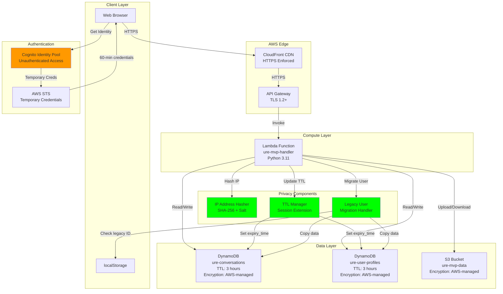
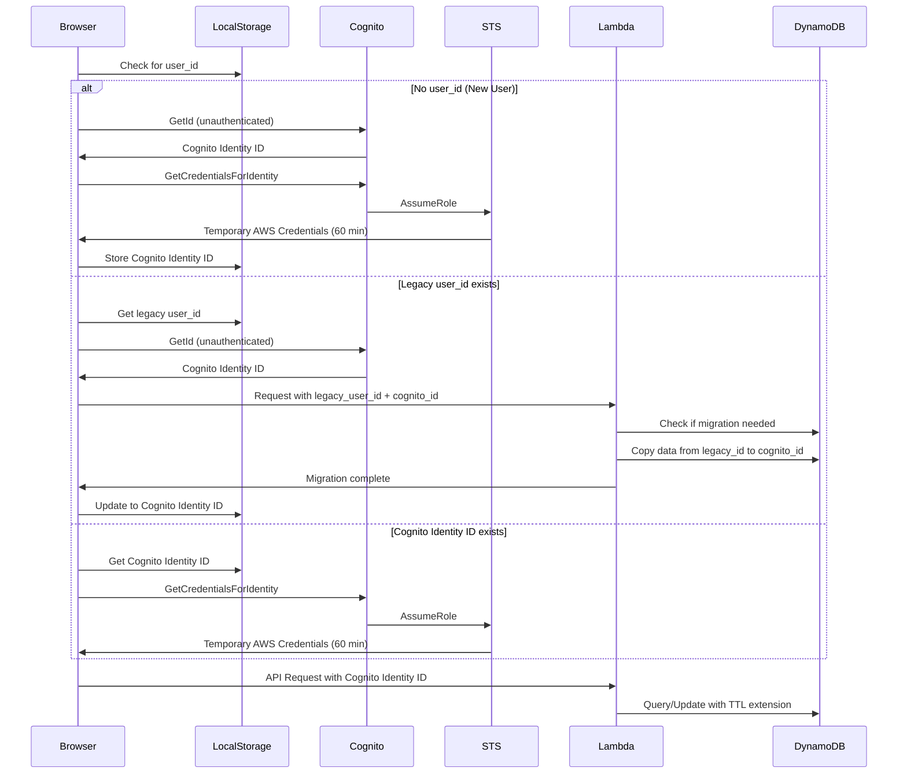
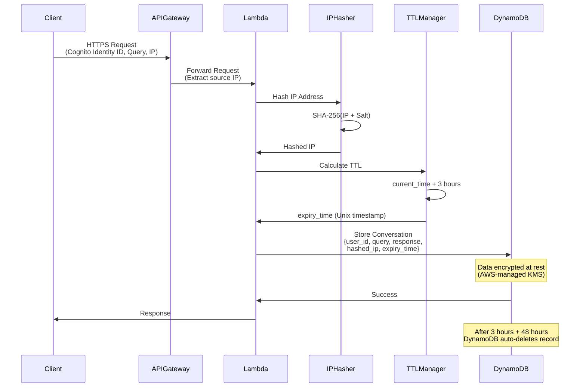
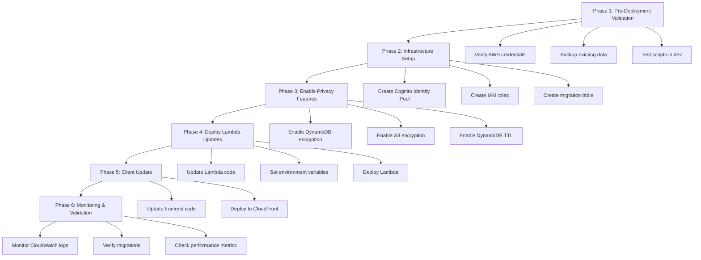

# AWS Privacy & Security Suite MVP - Design Document

## Overview

This design document specifies the technical architecture and implementation approach for the AWS Privacy & Security Suite MVP. The MVP focuses on delivering core privacy and security capabilities for the GramSetu agricultural assistant application with minimal complexity and cost.

### Design Goals

1. **Anonymous Authentication**: Replace localStorage-based user IDs with Amazon Cognito Identity Pool for secure, anonymous authentication
2. **Automatic Data Deletion**: Implement session-based privacy with DynamoDB TTL for automatic data cleanup after 3 hours of inactivity
3. **Privacy Protection**: Hash IP addresses before storage to protect user location privacy
4. **Data Security**: Enable encryption at rest for all data stores using AWS-managed keys
5. **Minimal Disruption**: Seamless migration for existing users with zero data loss
6. **Simple Deployment**: Python-based deployment scripts for quick rollout

### Key Design Principles

- **Privacy by Default**: All privacy features enabled automatically
- **Backward Compatibility**: Support legacy user IDs during 30-day migration window
- **Fail-Safe**: Graceful degradation if Cognito is unavailable
- **Cost-Effective**: Leverage AWS free tier and managed services
- **Operationally Simple**: Minimal ongoing maintenance required

### Scope

**In Scope (MVP):**
- Cognito Identity Pool for anonymous authentication
- Legacy user migration from localStorage to Cognito
- DynamoDB TTL for automatic data deletion (3-hour sessions)
- IP address hashing with SHA-256
- Encryption at rest with AWS-managed KMS keys
- HTTPS enforcement validation
- Basic data deletion API
- Python deployment scripts

**Out of Scope (Post-MVP):**
- VPC isolation and network security
- Advanced audit logging and CloudWatch dashboards
- GDPR compliance documentation
- Customer-managed KMS keys
- Configurable session durations
- IP salt rotation
- Data export API

---

## Architecture

### High-Level Architecture



### Authentication Flow



### Data Flow with Privacy Features



---

## Components and Interfaces

### Component 1: Cognito Identity Pool

**Purpose**: Provide anonymous authentication and temporary AWS credentials for unauthenticated users.

**Configuration**:
```json
{
  "IdentityPoolName": "GramSetuAnonymousUsers",
  "AllowUnauthenticatedIdentities": true,
  "AllowClassicFlow": false,
  "SupportedLoginProviders": {}
}
```

**IAM Role for Unauthenticated Users**:
```json
{
  "Version": "2012-10-17",
  "Statement": [
    {
      "Effect": "Allow",
      "Action": [
        "execute-api:Invoke"
      ],
      "Resource": "arn:aws:execute-api:us-east-1:*:*/*/POST/*"
    }
  ]
}
```

**Key Properties**:
- Identity ID Format: `us-east-1:xxxxxxxx-xxxx-xxxx-xxxx-xxxxxxxxxxxx`
- Credential Duration: 60 minutes (default for unauthenticated)
- Auto-refresh: Client SDK handles refresh 5 minutes before expiry
- Region: us-east-1 (same as existing infrastructure)

**Interface**:
```python
# Client-side (JavaScript)
AWS.config.region = 'us-east-1';
AWS.config.credentials = new AWS.CognitoIdentityCredentials({
    IdentityPoolId: 'us-east-1:IDENTITY_POOL_ID'
});

# Get Identity ID
identity_id = AWS.config.credentials.identityId

# Credentials auto-refresh handled by SDK
```

**Error Handling**:
- If Cognito unavailable: Fall back to legacy localStorage ID (temporary)
- If credential refresh fails: Prompt user to refresh page
- Log all Cognito errors to CloudWatch

---

### Component 2: Legacy User Migration Handler

**Purpose**: Seamlessly migrate existing users from localStorage-based IDs to Cognito Identity IDs without data loss.

**Migration Detection Logic**:
```python
def detect_migration_needed(event_body):
    """
    Detect if user needs migration based on request parameters
    
    Returns:
        tuple: (needs_migration, legacy_user_id, cognito_identity_id)
    """
    user_id = event_body.get('user_id')
    cognito_identity_id = event_body.get('cognito_identity_id')
    
    # Case 1: New user with Cognito ID only
    if cognito_identity_id and not user_id:
        return False, None, cognito_identity_id
    
    # Case 2: Legacy user with old ID format
    if user_id and user_id.startswith('farmer_'):
        # Check if Cognito ID also provided (migration in progress)
        if cognito_identity_id:
            return True, user_id, cognito_identity_id
        else:
            # Legacy user without Cognito ID yet
            return False, user_id, None
    
    # Case 3: Already migrated (Cognito ID format)
    if user_id and ':' in user_id:
        return False, None, user_id
    
    return False, user_id, cognito_identity_id
```

**Migration Process**:
```python
def migrate_user_data(legacy_user_id, cognito_identity_id):
    """
    Migrate user data from legacy ID to Cognito ID
    
    Steps:
    1. Check if migration already completed
    2. Copy conversations from legacy ID to Cognito ID
    3. Copy user profile from legacy ID to Cognito ID
    4. Mark legacy records for deletion (set short TTL)
    5. Return migration status
    """
    dynamodb = boto3.resource('dynamodb')
    
    # Check if already migrated
    migration_table = dynamodb.Table('ure-user-migrations')
    existing = migration_table.get_item(
        Key={'legacy_user_id': legacy_user_id}
    )
    
    if 'Item' in existing:
        logger.info(f"User {legacy_user_id} already migrated")
        return {'status': 'already_migrated', 'cognito_id': cognito_identity_id}
    
    # Copy conversations
    conv_table = dynamodb.Table('ure-conversations')
    legacy_conv = conv_table.get_item(Key={'user_id': legacy_user_id})
    
    if 'Item' in legacy_conv:
        conversations = legacy_conv['Item'].get('conversations', [])
        
        # Create new record with Cognito ID
        conv_table.put_item(Item={
            'user_id': cognito_identity_id,
            'conversations': conversations,
            'last_updated': datetime.utcnow().isoformat(),
            'expiry_time': int(time.time()) + (3 * 3600),  # 3 hours TTL
            'migrated_from': legacy_user_id
        })
        
        # Mark legacy record for deletion (1 hour TTL)
        conv_table.update_item(
            Key={'user_id': legacy_user_id},
            UpdateExpression='SET expiry_time = :ttl',
            ExpressionAttributeValues={
                ':ttl': int(time.time()) + 3600  # Delete in 1 hour
            }
        )
    
    # Copy user profile
    profile_table = dynamodb.Table('ure-user-profiles')
    legacy_profile = profile_table.get_item(Key={'user_id': legacy_user_id})
    
    if 'Item' in legacy_profile:
        profile_data = legacy_profile['Item']
        profile_data['user_id'] = cognito_identity_id
        profile_data['expiry_time'] = int(time.time()) + (3 * 3600)
        profile_data['migrated_from'] = legacy_user_id
        
        profile_table.put_item(Item=profile_data)
        
        # Mark legacy profile for deletion
        profile_table.update_item(
            Key={'user_id': legacy_user_id},
            UpdateExpression='SET expiry_time = :ttl',
            ExpressionAttributeValues={
                ':ttl': int(time.time()) + 3600
            }
        )
    
    # Record migration
    migration_table.put_item(Item={
        'legacy_user_id': legacy_user_id,
        'cognito_identity_id': cognito_identity_id,
        'migration_timestamp': datetime.utcnow().isoformat(),
        'expiry_time': int(time.time()) + (30 * 86400)  # Keep record for 30 days
    })
    
    logger.info(f"Successfully migrated {legacy_user_id} to {cognito_identity_id}")
    
    return {
        'status': 'migrated',
        'cognito_id': cognito_identity_id,
        'conversations_migrated': len(conversations) if 'Item' in legacy_conv else 0
    }
```

**Migration Table Schema**:
```python
# New table: ure-user-migrations
{
    'legacy_user_id': 'farmer_1234567890_abc',  # Partition key
    'cognito_identity_id': 'us-east-1:xxxx-xxxx-xxxx',
    'migration_timestamp': '2024-01-15T10:30:00Z',
    'expiry_time': 1234567890  # TTL: 30 days
}
```

**Client-Side Migration Support**:
```javascript
// Frontend migration logic
async function getUserIdentity() {
    // Check for existing user ID
    const legacyUserId = localStorage.getItem('user_id');
    
    // Get Cognito Identity
    await AWS.config.credentials.getPromise();
    const cognitoIdentityId = AWS.config.credentials.identityId;
    
    // If legacy ID exists, trigger migration
    if (legacyUserId && legacyUserId.startsWith('farmer_')) {
        console.log('Migrating legacy user:', legacyUserId);
        
        // Send both IDs to Lambda for migration
        const response = await fetch(API_ENDPOINT, {
            method: 'POST',
            body: JSON.stringify({
                user_id: legacyUserId,
                cognito_identity_id: cognitoIdentityId,
                query: 'migration_request'
            })
        });
        
        // Update localStorage with new Cognito ID
        localStorage.setItem('user_id', cognitoIdentityId);
        localStorage.setItem('migrated_from', legacyUserId);
        localStorage.setItem('migration_date', new Date().toISOString());
    } else {
        // New user or already migrated
        localStorage.setItem('user_id', cognitoIdentityId);
    }
    
    return cognitoIdentityId;
}
```

---

### Component 3: TTL Manager

**Purpose**: Manage DynamoDB Time-To-Live attributes for automatic data deletion after session expiry.

**TTL Configuration**:
```python
# Enable TTL on tables (one-time setup)
def enable_ttl_on_table(table_name, ttl_attribute='expiry_time'):
    """Enable TTL on DynamoDB table"""
    dynamodb_client = boto3.client('dynamodb')
    
    response = dynamodb_client.update_time_to_live(
        TableName=table_name,
        TimeToLiveSpecification={
            'Enabled': True,
            'AttributeName': ttl_attribute
        }
    )
    
    return response

# Tables to enable TTL:
# - ure-conversations
# - ure-user-profiles
# - ure-user-migrations
```

**TTL Calculation Logic**:
```python
import time

class TTLManager:
    """Manage TTL for user sessions"""
    
    SESSION_DURATION_SECONDS = 3 * 3600  # 3 hours
    
    @staticmethod
    def calculate_expiry_time():
        """
        Calculate expiry time for new records
        
        Returns:
            int: Unix timestamp for expiry (current time + 3 hours)
        """
        return int(time.time()) + TTLManager.SESSION_DURATION_SECONDS
    
    @staticmethod
    def extend_session(current_expiry_time=None):
        """
        Extend session by resetting TTL to 3 hours from now
        
        Args:
            current_expiry_time: Existing expiry time (ignored, always reset)
        
        Returns:
            int: New expiry time
        """
        return TTLManager.calculate_expiry_time()
    
    @staticmethod
    def is_expired(expiry_time):
        """
        Check if a record has expired
        
        Args:
            expiry_time: Unix timestamp
        
        Returns:
            bool: True if expired
        """
        return int(time.time()) > expiry_time
```

**Integration with Lambda Handler**:
```python
def store_conversation_with_ttl(
    user_id: str,
    query: str,
    response: str,
    agent_used: str,
    metadata: Optional[Dict] = None
):
    """Store conversation with TTL"""
    try:
        table = dynamodb.Table(CONVERSATIONS_TABLE)
        ttl_manager = TTLManager()
        
        # Get existing conversations
        existing = table.get_item(Key={'user_id': user_id})
        conversations = existing.get('Item', {}).get('conversations', [])
        
        # Add new conversation
        conversations.append({
            'timestamp': datetime.utcnow().isoformat(),
            'query': query,
            'response': response,
            'agent_used': agent_used,
            'metadata': metadata or {}
        })
        
        # Keep only last 50 conversations
        if len(conversations) > 50:
            conversations = conversations[-50:]
        
        # Calculate TTL (extends session on every interaction)
        expiry_time = ttl_manager.calculate_expiry_time()
        
        # Update table with TTL
        table.put_item(Item={
            'user_id': user_id,
            'conversations': conversations,
            'last_updated': datetime.utcnow().isoformat(),
            'expiry_time': expiry_time  # TTL attribute
        })
        
        logger.info(f"Stored conversation for {user_id}, expires at {expiry_time}")
    
    except ClientError as e:
        logger.error(f"Failed to store conversation: {e}")
```

**TTL Behavior**:
- DynamoDB checks TTL attributes periodically (typically within 48 hours of expiry)
- Expired items are deleted automatically without consuming write capacity
- No additional cost for TTL deletion
- Items may remain visible for up to 48 hours after expiry time
- TTL is extended on every user interaction (query, response)

---

### Component 4: IP Address Hasher

**Purpose**: Hash IP addresses before storage to protect user location privacy.

**Implementation**:
```python
import hashlib
import os

class IPAddressHasher:
    """Hash IP addresses for privacy protection"""
    
    def __init__(self):
        """Initialize with salt from environment variable"""
        self.salt = os.environ.get('IP_HASH_SALT', 'default_salt_change_me')
        
        if self.salt == 'default_salt_change_me':
            logger.warning("Using default IP hash salt - should be changed in production")
    
    def hash_ip(self, ip_address: str) -> str:
        """
        Hash IP address using SHA-256 with salt
        
        Args:
            ip_address: IPv4 or IPv6 address
        
        Returns:
            str: Hex-encoded SHA-256 hash
        """
        if not ip_address:
            return None
        
        # Combine IP with salt
        salted_ip = f"{ip_address}{self.salt}"
        
        # Hash with SHA-256
        hash_object = hashlib.sha256(salted_ip.encode('utf-8'))
        hashed_ip = hash_object.hexdigest()
        
        logger.debug(f"Hashed IP address (first 8 chars): {hashed_ip[:8]}...")
        
        return hashed_ip
    
    def extract_ip_from_event(self, event: Dict[str, Any]) -> Optional[str]:
        """
        Extract source IP from API Gateway event
        
        Args:
            event: Lambda event from API Gateway
        
        Returns:
            str: Source IP address or None
        """
        # API Gateway includes source IP in requestContext
        request_context = event.get('requestContext', {})
        identity = request_context.get('identity', {})
        source_ip = identity.get('sourceIp')
        
        # Fallback to headers if not in requestContext
        if not source_ip:
            headers = event.get('headers', {})
            # Check X-Forwarded-For header (CloudFront)
            source_ip = headers.get('X-Forwarded-For', '').split(',')[0].strip()
        
        return source_ip if source_ip else None
```

**Integration with Lambda Handler**:
```python
# Initialize IP hasher (module level)
ip_hasher = IPAddressHasher()

def lambda_handler(event: Dict[str, Any], context: Any) -> Dict[str, Any]:
    """Lambda handler with IP hashing"""
    try:
        # Extract and hash IP address
        source_ip = ip_hasher.extract_ip_from_event(event)
        hashed_ip = ip_hasher.hash_ip(source_ip) if source_ip else None
        
        # Parse request body
        if 'body' in event:
            body = json.loads(event['body']) if isinstance(event['body'], str) else event['body']
        else:
            body = event
        
        # Add hashed IP to metadata
        metadata = body.get('metadata', {})
        if hashed_ip:
            metadata['hashed_ip'] = hashed_ip
            metadata['ip_hashed_at'] = datetime.utcnow().isoformat()
        
        # Continue with normal processing...
        # NEVER store source_ip in plaintext
        
    except Exception as e:
        logger.error(f"Lambda handler error: {e}", exc_info=True)
```

**Salt Management**:
- Salt stored as Lambda environment variable: `IP_HASH_SALT`
- Salt should be a random 32-character string
- Salt is fixed for MVP (no rotation)
- Post-MVP: Move to AWS Secrets Manager with rotation

**Environment Variable Configuration**:
```bash
# Generate salt (one-time)
python3 -c "import secrets; print(secrets.token_hex(16))"

# Set in Lambda environment
IP_HASH_SALT=<generated_salt_value>
```

---

### Component 5: Encryption Manager

**Purpose**: Ensure all data at rest is encrypted using AWS-managed KMS keys.

**DynamoDB Encryption Configuration**:
```python
def enable_dynamodb_encryption(table_name):
    """Enable encryption at rest for DynamoDB table"""
    dynamodb_client = boto3.client('dynamodb')
    
    # Update table to use AWS-managed KMS key
    response = dynamodb_client.update_table(
        TableName=table_name,
        SSESpecification={
            'Enabled': True,
            'SSEType': 'KMS',
            # No KMSMasterKeyId = use AWS-managed key (aws/dynamodb)
        }
    )
    
    return response

# Tables to encrypt:
# - ure-conversations
# - ure-user-profiles
# - ure-user-migrations
```

**S3 Encryption Configuration**:
```python
def enable_s3_encryption(bucket_name):
    """Enable default encryption for S3 bucket"""
    s3_client = boto3.client('s3')
    
    # Set default encryption to AWS-managed KMS
    response = s3_client.put_bucket_encryption(
        Bucket=bucket_name,
        ServerSideEncryptionConfiguration={
            'Rules': [
                {
                    'ApplyServerSideEncryptionByDefault': {
                        'SSEAlgorithm': 'aws:kms',
                        # No KMSMasterKeyID = use AWS-managed key (aws/s3)
                    },
                    'BucketKeyEnabled': True  # Reduce KMS costs
                }
            ]
        }
    )
    
    return response
```

**Verification**:
```python
def verify_encryption_status():
    """Verify encryption is enabled on all resources"""
    results = {}
    
    # Check DynamoDB tables
    dynamodb_client = boto3.client('dynamodb')
    for table_name in ['ure-conversations', 'ure-user-profiles', 'ure-user-migrations']:
        response = dynamodb_client.describe_table(TableName=table_name)
        sse_description = response['Table'].get('SSEDescription', {})
        results[table_name] = {
            'encrypted': sse_description.get('Status') == 'ENABLED',
            'sse_type': sse_description.get('SSEType')
        }
    
    # Check S3 bucket
    s3_client = boto3.client('s3')
    bucket_name = 'ure-mvp-data-us-east-1-188238313375'
    try:
        response = s3_client.get_bucket_encryption(Bucket=bucket_name)
        results[bucket_name] = {
            'encrypted': True,
            'algorithm': response['ServerSideEncryptionConfiguration']['Rules'][0]['ApplyServerSideEncryptionByDefault']['SSEAlgorithm']
        }
    except ClientError as e:
        if e.response['Error']['Code'] == 'ServerSideEncryptionConfigurationNotFoundError':
            results[bucket_name] = {'encrypted': False}
    
    return results
```

**Key Properties**:
- AWS-managed keys: No additional cost, automatic rotation
- Encryption transparent to application code
- No performance impact (encryption handled by AWS)
- Keys managed by AWS (no operational overhead)

---

### Component 6: Data Deletion API

**Purpose**: Provide immediate data deletion capability for privacy-conscious users.

**API Endpoint**:
```
POST /api/delete-user-data
```

**Request Format**:
```json
{
  "user_id": "us-east-1:xxxx-xxxx-xxxx",
  "confirmation": "DELETE_MY_DATA"
}
```

**Implementation**:
```python
def delete_user_data(user_id: str) -> Dict[str, Any]:
    """
    Delete all user data immediately
    
    Args:
        user_id: Cognito Identity ID
    
    Returns:
        dict: Deletion status
    """
    try:
        dynamodb = boto3.resource('dynamodb')
        s3_client = boto3.client('s3')
        
        deleted_items = []
        
        # Delete conversations
        conv_table = dynamodb.Table('ure-conversations')
        try:
            conv_table.delete_item(Key={'user_id': user_id})
            deleted_items.append('conversations')
        except ClientError as e:
            logger.error(f"Failed to delete conversations: {e}")
        
        # Delete user profile
        profile_table = dynamodb.Table('ure-user-profiles')
        try:
            profile_table.delete_item(Key={'user_id': user_id})
            deleted_items.append('user_profile')
        except ClientError as e:
            logger.error(f"Failed to delete user profile: {e}")
        
        # Delete uploaded images from S3
        try:
            prefix = f"uploads/{user_id}/"
            response = s3_client.list_objects_v2(
                Bucket=S3_BUCKET,
                Prefix=prefix
            )
            
            if 'Contents' in response:
                objects_to_delete = [{'Key': obj['Key']} for obj in response['Contents']]
                s3_client.delete_objects(
                    Bucket=S3_BUCKET,
                    Delete={'Objects': objects_to_delete}
                )
                deleted_items.append(f"s3_objects_{len(objects_to_delete)}")
        except ClientError as e:
            logger.error(f"Failed to delete S3 objects: {e}")
        
        logger.info(f"Deleted data for user {user_id}: {deleted_items}")
        
        return {
            'success': True,
            'user_id': user_id,
            'deleted_items': deleted_items,
            'timestamp': datetime.utcnow().isoformat()
        }
    
    except Exception as e:
        logger.error(f"Failed to delete user data: {e}", exc_info=True)
        return {
            'success': False,
            'error': str(e)
        }
```

**Lambda Handler Integration**:
```python
def lambda_handler(event: Dict[str, Any], context: Any) -> Dict[str, Any]:
    """Lambda handler with data deletion support"""
    
    # Parse request
    if 'body' in event:
        body = json.loads(event['body']) if isinstance(event['body'], str) else event['body']
    else:
        body = event
    
    # Check if this is a deletion request
    if body.get('action') == 'delete_user_data':
        user_id = body.get('user_id')
        confirmation = body.get('confirmation')
        
        # Validate confirmation
        if confirmation != 'DELETE_MY_DATA':
            return {
                'statusCode': 400,
                'body': json.dumps({
                    'error': 'Invalid confirmation. Must be "DELETE_MY_DATA"'
                })
            }
        
        # Perform deletion
        result = delete_user_data(user_id)
        
        return {
            'statusCode': 200 if result['success'] else 500,
            'headers': {
                'Content-Type': 'application/json',
                'Access-Control-Allow-Origin': '*'
            },
            'body': json.dumps(result)
        }
    
    # Continue with normal query processing...
```

**Client-Side Integration**:
```javascript
async function deleteMyData() {
    const userId = localStorage.getItem('user_id');
    
    const confirmed = confirm(
        'Are you sure you want to delete all your data? This cannot be undone.'
    );
    
    if (!confirmed) return;
    
    const response = await fetch(API_ENDPOINT, {
        method: 'POST',
        headers: {'Content-Type': 'application/json'},
        body: JSON.stringify({
            action: 'delete_user_data',
            user_id: userId,
            confirmation: 'DELETE_MY_DATA'
        })
    });
    
    const result = await response.json();
    
    if (result.success) {
        // Clear local storage
        localStorage.clear();
        alert('Your data has been deleted successfully.');
        window.location.reload();
    } else {
        alert('Failed to delete data: ' + result.error);
    }
}
```

---

## Data Models

### DynamoDB Table: ure-conversations (Updated)

**Schema**:
```python
{
    'user_id': 'us-east-1:xxxx-xxxx-xxxx',  # Partition key (Cognito Identity ID)
    'conversations': [
        {
            'timestamp': '2024-01-15T10:30:00Z',
            'query': 'What disease is affecting my tomato plant?',
            'response': 'Based on the symptoms...',
            'agent_used': 'agri-expert',
            'metadata': {
                'hashed_ip': 'a1b2c3d4e5f6...',
                'ip_hashed_at': '2024-01-15T10:30:00Z',
                'pdf_links': [...],
                'website_links': [...]
            }
        }
    ],
    'last_updated': '2024-01-15T10:30:00Z',
    'expiry_time': 1705324200,  # Unix timestamp (TTL attribute)
    'migrated_from': 'farmer_1234567890_abc'  # Optional: legacy user ID
}
```

**Indexes**: None (single-item queries by user_id)

**TTL Configuration**:
- Attribute: `expiry_time`
- Type: Number (Unix timestamp)
- Behavior: Auto-delete after expiry + up to 48 hours

**Encryption**:
- Type: AWS-managed KMS key
- Key: `aws/dynamodb`
- Cost: No additional charge

---

### DynamoDB Table: ure-user-profiles (Updated)

**Schema**:
```python
{
    'user_id': 'us-east-1:xxxx-xxxx-xxxx',  # Partition key (Cognito Identity ID)
    'language': 'en',
    'location': 'Maharashtra, India',
    'preferences': {
        'crop_types': ['tomato', 'wheat'],
        'notification_enabled': False
    },
    'created_at': '2024-01-15T10:30:00Z',
    'last_updated': '2024-01-15T10:30:00Z',
    'expiry_time': 1705324200,  # Unix timestamp (TTL attribute)
    'migrated_from': 'farmer_1234567890_abc'  # Optional
}
```

**Indexes**: None

**TTL Configuration**:
- Attribute: `expiry_time`
- Type: Number (Unix timestamp)
- Behavior: Auto-delete after expiry + up to 48 hours

**Encryption**:
- Type: AWS-managed KMS key
- Key: `aws/dynamodb`

---

### DynamoDB Table: ure-user-migrations (New)

**Purpose**: Track legacy user migrations to prevent duplicate migrations and support rollback.

**Schema**:
```python
{
    'legacy_user_id': 'farmer_1234567890_abc',  # Partition key
    'cognito_identity_id': 'us-east-1:xxxx-xxxx-xxxx',
    'migration_timestamp': '2024-01-15T10:30:00Z',
    'migration_status': 'completed',  # completed, failed, in_progress
    'conversations_migrated': 15,
    'profile_migrated': True,
    'expiry_time': 1707916200  # Unix timestamp (30 days TTL)
}
```

**Indexes**:
- GSI: `cognito_identity_id-index` (for reverse lookup)

**TTL Configuration**:
- Attribute: `expiry_time`
- Duration: 30 days (for audit trail)

**Encryption**:
- Type: AWS-managed KMS key

**Table Creation**:
```python
def create_migration_table():
    """Create user migrations tracking table"""
    dynamodb = boto3.client('dynamodb')
    
    response = dynamodb.create_table(
        TableName='ure-user-migrations',
        KeySchema=[
            {'AttributeName': 'legacy_user_id', 'KeyType': 'HASH'}
        ],
        AttributeDefinitions=[
            {'AttributeName': 'legacy_user_id', 'AttributeType': 'S'},
            {'AttributeName': 'cognito_identity_id', 'AttributeType': 'S'}
        ],
        GlobalSecondaryIndexes=[
            {
                'IndexName': 'cognito_identity_id-index',
                'KeySchema': [
                    {'AttributeName': 'cognito_identity_id', 'KeyType': 'HASH'}
                ],
                'Projection': {'ProjectionType': 'ALL'},
                'ProvisionedThroughput': {
                    'ReadCapacityUnits': 1,
                    'WriteCapacityUnits': 1
                }
            }
        ],
        BillingMode='PAY_PER_REQUEST',
        SSESpecification={
            'Enabled': True,
            'SSEType': 'KMS'
        }
    )
    
    return response
```

---

### S3 Bucket: ure-mvp-data-us-east-1-188238313375 (Updated)

**Encryption Configuration**:
```json
{
  "ServerSideEncryptionConfiguration": {
    "Rules": [
      {
        "ApplyServerSideEncryptionByDefault": {
          "SSEAlgorithm": "aws:kms"
        },
        "BucketKeyEnabled": true
      }
    ]
  }
}
```

**Object Structure**:
```
ure-mvp-data-us-east-1-188238313375/
├── schemes/
│   ├── PMFBY_Scheme_Guidelines.pdf
│   ├── PKVY_Organic_Farming_Guidelines.pdf
│   └── ...
├── schemes/extracted/
│   ├── PMFBY_Application_Form.pdf
│   └── ...
└── uploads/
    └── {cognito_identity_id}/  # User-specific uploads
        ├── {uuid1}.jpg
        └── {uuid2}.jpg
```

**Lifecycle Policy** (Post-MVP):
```json
{
  "Rules": [
    {
      "Id": "DeleteOldUploads",
      "Status": "Enabled",
      "Prefix": "uploads/",
      "Expiration": {
        "Days": 7
      }
    }
  ]
}
```

---

## Correctness Properties

*A property is a characteristic or behavior that should hold true across all valid executions of a system—essentially, a formal statement about what the system should do. Properties serve as the bridge between human-readable specifications and machine-verifiable correctness guarantees.*

### Property 1: Cognito Identity Generation Performance

*For any* anonymous user request to the GramSetu system, the Cognito Identity Pool should generate a Cognito Identity ID within 2 seconds.

**Validates: Requirements 1.2**

### Property 2: Credential Expiration Correctness

*For any* generated Cognito credentials, the expiration time should be 60 minutes (±1 minute tolerance) from the issuance timestamp.

**Validates: Requirements 1.3**

### Property 3: Cognito ID Format Consistency

*For any* data operation (read or write) in the system, the user_id field should match the Cognito Identity ID format (region:uuid pattern) or be a legacy ID during the migration window.

**Validates: Requirements 1.4**

### Property 4: Credential Auto-Refresh

*For any* user session, when credentials are within 5 minutes of expiration, the system should automatically refresh the credentials before they expire.

**Validates: Requirements 1.5**

### Property 5: Migration Trigger

*For any* user with a legacy user ID (format: farmer_*), accessing the system should trigger automatic Cognito Identity ID creation and data migration.

**Validates: Requirements 2.1**

### Property 6: Complete Data Migration

*For any* legacy user with existing data (conversations and/or profile), after migration completes, all data should be accessible via the new Cognito Identity ID with no data loss.

**Validates: Requirements 2.2, 2.3**

### Property 7: Dual Authentication Support

*For any* user during the 30-day migration window, both the legacy user ID and Cognito Identity ID should successfully authenticate and access the same user data.

**Validates: Requirements 2.5**

### Property 8: TTL Attribute Correctness

*For any* data record (conversation or user profile) written to DynamoDB, the expiry_time attribute should be set to approximately 3 hours (10800 seconds ±60 seconds) from the current timestamp.

**Validates: Requirements 3.1, 3.2**

### Property 9: Session Extension on Interaction

*For any* user interaction (query, response, profile update), the TTL attribute should be updated to 3 hours from the interaction time, effectively extending the session.

**Validates: Requirements 3.4**

### Property 10: IP Address Hashing Determinism

*For any* IP address, hashing it multiple times with the same salt should produce the same hash value (deterministic hashing), and different IP addresses should produce different hash values.

**Validates: Requirements 4.1, 4.2**

### Property 11: No Plaintext IP Storage

*For any* data stored in DynamoDB or S3, there should be no fields containing plaintext IP addresses matching IPv4 (xxx.xxx.xxx.xxx) or IPv6 formats.

**Validates: Requirements 4.4**

### Property 12: Response Time Performance

*For any* 100 consecutive user requests with Cognito authentication and encryption enabled, the 95th percentile response time should be below 3 seconds.

**Validates: Requirements 7.1, 7.2**

### Property 13: Deployment Script Credential Validation

*For any* deployment script execution, the script should validate AWS credentials and permissions before attempting any resource modifications, failing fast if credentials are invalid.

**Validates: Requirements 8.5**

### Property 14: Data Deletion Completeness

*For any* user data deletion request, all associated records (conversations, profile, S3 uploads) should be deleted within 5 minutes, and subsequent queries for that user_id should return no data.

**Validates: Requirements 9.2**

---

## Error Handling

### Cognito Errors

**Error Scenario**: Cognito Identity Pool unavailable or rate limited

**Handling Strategy**:
```python
def get_or_create_cognito_identity(legacy_user_id=None):
    """Get Cognito identity with fallback to legacy ID"""
    try:
        # Attempt to get Cognito identity
        cognito_client = boto3.client('cognito-identity')
        response = cognito_client.get_id(
            IdentityPoolId=COGNITO_IDENTITY_POOL_ID
        )
        return response['IdentityId']
    
    except ClientError as e:
        error_code = e.response['Error']['Code']
        
        if error_code == 'TooManyRequestsException':
            logger.error("Cognito rate limit exceeded")
            # Fallback to legacy ID temporarily
            if legacy_user_id:
                return legacy_user_id
            else:
                # Generate temporary ID
                return f"temp_{int(time.time())}_{secrets.token_hex(4)}"
        
        elif error_code == 'ResourceNotFoundException':
            logger.error("Cognito Identity Pool not found")
            raise Exception("Authentication service unavailable")
        
        else:
            logger.error(f"Cognito error: {e}")
            # Fallback to legacy ID
            if legacy_user_id:
                return legacy_user_id
            raise
```

**User Impact**: Graceful degradation - users can still access the system with temporary IDs

---

### Migration Errors

**Error Scenario**: Migration fails mid-process (partial data copied)

**Handling Strategy**:
```python
def migrate_user_data_with_rollback(legacy_user_id, cognito_identity_id):
    """Migrate with transaction-like rollback"""
    try:
        # Check if already migrated
        if is_already_migrated(legacy_user_id):
            return {'status': 'already_migrated'}
        
        # Mark migration as in-progress
        mark_migration_status(legacy_user_id, 'in_progress')
        
        # Perform migration steps
        conv_migrated = migrate_conversations(legacy_user_id, cognito_identity_id)
        profile_migrated = migrate_profile(legacy_user_id, cognito_identity_id)
        
        # Mark as completed
        mark_migration_status(legacy_user_id, 'completed')
        
        return {
            'status': 'completed',
            'conversations_migrated': conv_migrated,
            'profile_migrated': profile_migrated
        }
    
    except Exception as e:
        logger.error(f"Migration failed for {legacy_user_id}: {e}")
        
        # Mark as failed
        mark_migration_status(legacy_user_id, 'failed')
        
        # Rollback: delete partial Cognito data
        try:
            delete_user_data(cognito_identity_id)
        except Exception as rollback_error:
            logger.error(f"Rollback failed: {rollback_error}")
        
        # Return error but allow user to continue with legacy ID
        return {
            'status': 'failed',
            'error': str(e),
            'fallback_user_id': legacy_user_id
        }
```

**User Impact**: Migration failure doesn't block user access - they continue with legacy ID and migration is retried on next access

---

### TTL Errors

**Error Scenario**: TTL attribute update fails

**Handling Strategy**:
```python
def store_conversation_with_ttl_fallback(user_id, query, response, agent_used, metadata):
    """Store conversation with TTL, fallback to no TTL if update fails"""
    try:
        # Calculate TTL
        expiry_time = TTLManager.calculate_expiry_time()
        
        # Store with TTL
        table.put_item(Item={
            'user_id': user_id,
            'conversations': conversations,
            'last_updated': datetime.utcnow().isoformat(),
            'expiry_time': expiry_time
        })
        
        logger.info(f"Stored conversation with TTL: {expiry_time}")
    
    except ClientError as e:
        logger.error(f"Failed to store with TTL: {e}")
        
        # Fallback: store without TTL (manual cleanup required)
        try:
            table.put_item(Item={
                'user_id': user_id,
                'conversations': conversations,
                'last_updated': datetime.utcnow().isoformat()
                # No expiry_time
            })
            
            logger.warning(f"Stored conversation WITHOUT TTL for {user_id}")
            
            # Alert for manual cleanup
            send_alert(f"TTL update failed for user {user_id}")
        
        except ClientError as fallback_error:
            logger.error(f"Fallback storage also failed: {fallback_error}")
            raise
```

**User Impact**: Conversation is still stored even if TTL fails - requires manual cleanup but doesn't block user

---

### IP Hashing Errors

**Error Scenario**: IP address extraction fails or salt is missing

**Handling Strategy**:
```python
def hash_ip_with_fallback(event):
    """Hash IP with fallback to null if extraction fails"""
    try:
        # Extract IP
        source_ip = ip_hasher.extract_ip_from_event(event)
        
        if not source_ip:
            logger.warning("Could not extract IP address from event")
            return None
        
        # Check salt
        if not ip_hasher.salt or ip_hasher.salt == 'default_salt_change_me':
            logger.error("IP hash salt not configured properly")
            # Still hash with default salt rather than storing plaintext
            hashed = ip_hasher.hash_ip(source_ip)
            send_alert("IP hash salt not configured - using default")
            return hashed
        
        # Hash normally
        return ip_hasher.hash_ip(source_ip)
    
    except Exception as e:
        logger.error(f"IP hashing failed: {e}")
        # Return None rather than plaintext IP
        return None
```

**User Impact**: No impact on user - IP hashing is transparent. Missing IP hash doesn't block requests.

---

### Encryption Errors

**Error Scenario**: KMS key unavailable or encryption fails

**Handling Strategy**:
- Encryption is handled transparently by AWS
- If KMS is unavailable, AWS DynamoDB/S3 operations will fail
- No application-level fallback (encryption is mandatory)
- Monitor KMS metrics and set up CloudWatch alarms

```python
# No fallback for encryption - fail fast
def verify_encryption_before_deployment():
    """Pre-deployment check for encryption"""
    results = verify_encryption_status()
    
    for resource, status in results.items():
        if not status.get('encrypted'):
            raise Exception(f"Encryption not enabled on {resource}")
    
    logger.info("All resources encrypted - deployment can proceed")
```

**User Impact**: If encryption fails, requests fail (fail-secure approach). Requires immediate remediation.

---

### Data Deletion Errors

**Error Scenario**: Deletion fails for some resources

**Handling Strategy**:
```python
def delete_user_data_with_retry(user_id, max_retries=3):
    """Delete user data with retry logic"""
    deleted_items = []
    failed_items = []
    
    # Try to delete each resource type
    resources = [
        ('conversations', lambda: delete_conversations(user_id)),
        ('profile', lambda: delete_profile(user_id)),
        ('s3_uploads', lambda: delete_s3_uploads(user_id))
    ]
    
    for resource_name, delete_func in resources:
        for attempt in range(max_retries):
            try:
                delete_func()
                deleted_items.append(resource_name)
                break
            except Exception as e:
                logger.error(f"Deletion attempt {attempt+1} failed for {resource_name}: {e}")
                if attempt == max_retries - 1:
                    failed_items.append(resource_name)
                else:
                    time.sleep(2 ** attempt)  # Exponential backoff
    
    # Return partial success
    return {
        'success': len(failed_items) == 0,
        'deleted_items': deleted_items,
        'failed_items': failed_items,
        'user_id': user_id
    }
```

**User Impact**: User is informed of partial deletion. Failed items are logged for manual cleanup.

---

## Testing Strategy

### Dual Testing Approach

The MVP will use both unit testing and property-based testing to ensure comprehensive coverage:

**Unit Tests**: Verify specific examples, edge cases, error conditions, and configuration
- Specific migration scenarios (legacy user with 0, 1, 10, 50 conversations)
- Edge cases (empty IP address, missing salt, expired credentials)
- Error conditions (Cognito unavailable, DynamoDB throttling, KMS errors)
- Configuration validation (encryption enabled, TTL configured, HTTPS enforced)

**Property Tests**: Verify universal properties across all inputs
- Cognito ID generation performance across 1000+ requests
- TTL correctness across random timestamps and interaction patterns
- IP hashing determinism across random IP addresses
- Migration completeness across random user data sets
- Response time performance across random queries

Together, these approaches provide comprehensive coverage: unit tests catch concrete bugs and validate specific scenarios, while property tests verify general correctness across the input space.

---

### Property-Based Testing Configuration

**Library Selection**: 
- Python: `hypothesis` (mature, well-documented, integrates with pytest)
- Installation: `pip install hypothesis pytest`

**Test Configuration**:
```python
# conftest.py
from hypothesis import settings, Verbosity

# Configure hypothesis for all tests
settings.register_profile("default", max_examples=100, verbosity=Verbosity.normal)
settings.register_profile("ci", max_examples=200, verbosity=Verbosity.verbose)
settings.load_profile("default")
```

**Minimum Iterations**: 100 per property test (configurable via hypothesis settings)

**Test Tagging**: Each property test must reference its design document property
```python
# Feature: aws-privacy-security-suite, Property 1: Cognito Identity Generation Performance
@given(st.integers(min_value=1, max_value=1000))
def test_cognito_identity_generation_performance(num_requests):
    """Property 1: Cognito ID generation should complete within 2 seconds"""
    # Test implementation
```

---

### Unit Test Examples

#### Test 1: Cognito Identity Pool Configuration
```python
def test_cognito_pool_allows_unauthenticated_access():
    """Verify Cognito Identity Pool is configured for anonymous users"""
    cognito_client = boto3.client('cognito-identity')
    
    response = cognito_client.describe_identity_pool(
        IdentityPoolId=COGNITO_IDENTITY_POOL_ID
    )
    
    assert response['AllowUnauthenticatedIdentities'] == True
    assert response['IdentityPoolName'] == 'GramSetuAnonymousUsers'
```

#### Test 2: Legacy User Migration - Empty User
```python
def test_migration_empty_legacy_user():
    """Test migration for legacy user with no data"""
    legacy_user_id = 'farmer_1234567890_test'
    cognito_id = 'us-east-1:test-uuid'
    
    result = migrate_user_data(legacy_user_id, cognito_id)
    
    assert result['status'] == 'migrated'
    assert result['conversations_migrated'] == 0
    assert result['profile_migrated'] == False
```

#### Test 3: TTL Configuration Verification
```python
def test_dynamodb_ttl_enabled():
    """Verify TTL is enabled on all required tables"""
    dynamodb_client = boto3.client('dynamodb')
    
    tables = ['ure-conversations', 'ure-user-profiles', 'ure-user-migrations']
    
    for table_name in tables:
        response = dynamodb_client.describe_time_to_live(TableName=table_name)
        ttl_status = response['TimeToLiveDescription']['TimeToLiveStatus']
        
        assert ttl_status == 'ENABLED'
        assert response['TimeToLiveDescription']['AttributeName'] == 'expiry_time'
```

#### Test 4: IP Hashing - Missing Salt
```python
def test_ip_hashing_with_missing_salt():
    """Test IP hashing behavior when salt is not configured"""
    # Temporarily remove salt
    original_salt = os.environ.get('IP_HASH_SALT')
    if 'IP_HASH_SALT' in os.environ:
        del os.environ['IP_HASH_SALT']
    
    hasher = IPAddressHasher()
    
    # Should still hash (with default salt) rather than fail
    hashed = hasher.hash_ip('192.168.1.1')
    assert hashed is not None
    assert len(hashed) == 64  # SHA-256 hex length
    
    # Restore salt
    if original_salt:
        os.environ['IP_HASH_SALT'] = original_salt
```

#### Test 5: Encryption Configuration
```python
def test_all_resources_encrypted():
    """Verify encryption is enabled on all data stores"""
    results = verify_encryption_status()
    
    # Check DynamoDB tables
    assert results['ure-conversations']['encrypted'] == True
    assert results['ure-user-profiles']['encrypted'] == True
    assert results['ure-user-migrations']['encrypted'] == True
    
    # Check S3 bucket
    assert results['ure-mvp-data-us-east-1-188238313375']['encrypted'] == True
```

#### Test 6: HTTPS Enforcement
```python
def test_http_redirects_to_https():
    """Verify HTTP requests are redirected to HTTPS"""
    import requests
    
    http_url = 'http://gramsetu.example.com/api/query'
    
    response = requests.get(http_url, allow_redirects=False)
    
    # Should get 301 or 302 redirect
    assert response.status_code in [301, 302]
    assert response.headers['Location'].startswith('https://')
```

#### Test 7: Data Deletion - Complete Removal
```python
def test_data_deletion_removes_all_records():
    """Test that data deletion removes all user data"""
    # Create test user with data
    test_user_id = 'us-east-1:test-delete-user'
    create_test_user_data(test_user_id)
    
    # Delete data
    result = delete_user_data(test_user_id)
    
    assert result['success'] == True
    assert 'conversations' in result['deleted_items']
    assert 'user_profile' in result['deleted_items']
    
    # Verify data is gone
    conv_table = dynamodb.Table('ure-conversations')
    response = conv_table.get_item(Key={'user_id': test_user_id})
    assert 'Item' not in response
```

---

### Property-Based Test Examples

#### Property Test 1: Cognito Identity Generation Performance
```python
# Feature: aws-privacy-security-suite, Property 1: Cognito Identity Generation Performance
from hypothesis import given, strategies as st
import time

@given(st.integers(min_value=1, max_value=100))
def test_cognito_identity_generation_performance(num_requests):
    """
    Property 1: For any anonymous user request, Cognito should generate 
    an Identity ID within 2 seconds
    """
    cognito_client = boto3.client('cognito-identity')
    
    for _ in range(num_requests):
        start_time = time.time()
        
        response = cognito_client.get_id(
            IdentityPoolId=COGNITO_IDENTITY_POOL_ID
        )
        
        elapsed_time = time.time() - start_time
        
        assert elapsed_time < 2.0, f"Cognito ID generation took {elapsed_time}s"
        assert 'IdentityId' in response
        assert response['IdentityId'].startswith('us-east-1:')
```

#### Property Test 2: Credential Expiration Correctness
```python
# Feature: aws-privacy-security-suite, Property 2: Credential Expiration Correctness
@given(st.integers(min_value=1, max_value=50))
def test_credential_expiration_correctness(num_credentials):
    """
    Property 2: For any generated Cognito credentials, expiration should be 
    60 minutes from issuance
    """
    cognito_client = boto3.client('cognito-identity')
    
    for _ in range(num_credentials):
        # Get identity
        identity_response = cognito_client.get_id(
            IdentityPoolId=COGNITO_IDENTITY_POOL_ID
        )
        identity_id = identity_response['IdentityId']
        
        # Get credentials
        issuance_time = time.time()
        creds_response = cognito_client.get_credentials_for_identity(
            IdentityId=identity_id
        )
        
        expiration = creds_response['Credentials']['Expiration']
        expiration_timestamp = expiration.timestamp()
        
        # Check expiration is ~60 minutes (3600 seconds ±60 seconds)
        expected_expiration = issuance_time + 3600
        assert abs(expiration_timestamp - expected_expiration) < 60
```

#### Property Test 3: TTL Attribute Correctness
```python
# Feature: aws-privacy-security-suite, Property 8: TTL Attribute Correctness
@given(
    st.text(min_size=10, max_size=200),  # Random query
    st.text(min_size=50, max_size=500)   # Random response
)
def test_ttl_attribute_correctness(query, response):
    """
    Property 8: For any data record, expiry_time should be ~3 hours from now
    """
    test_user_id = f"us-east-1:test-{secrets.token_hex(8)}"
    
    # Store conversation
    current_time = time.time()
    store_conversation_with_ttl(
        user_id=test_user_id,
        query=query,
        response=response,
        agent_used='test',
        metadata={}
    )
    
    # Retrieve and check TTL
    table = dynamodb.Table('ure-conversations')
    item = table.get_item(Key={'user_id': test_user_id})['Item']
    
    expiry_time = item['expiry_time']
    expected_expiry = current_time + (3 * 3600)  # 3 hours
    
    # Allow ±60 seconds tolerance
    assert abs(expiry_time - expected_expiry) < 60
    
    # Cleanup
    table.delete_item(Key={'user_id': test_user_id})
```

#### Property Test 4: IP Address Hashing Determinism
```python
# Feature: aws-privacy-security-suite, Property 10: IP Address Hashing Determinism
@given(
    st.ip_addresses(v=4).map(str),  # Random IPv4 addresses
    st.integers(min_value=2, max_value=10)  # Number of hash attempts
)
def test_ip_hashing_determinism(ip_address, num_attempts):
    """
    Property 10: For any IP address, hashing multiple times should produce 
    the same hash (deterministic)
    """
    hasher = IPAddressHasher()
    
    # Hash the same IP multiple times
    hashes = [hasher.hash_ip(ip_address) for _ in range(num_attempts)]
    
    # All hashes should be identical
    assert len(set(hashes)) == 1, "IP hashing is not deterministic"
    
    # Hash should be SHA-256 (64 hex characters)
    assert len(hashes[0]) == 64
```

#### Property Test 5: No Plaintext IP Storage
```python
# Feature: aws-privacy-security-suite, Property 11: No Plaintext IP Storage
@given(
    st.ip_addresses(v=4).map(str),  # Random IPv4
    st.text(min_size=10, max_size=100)  # Random query
)
def test_no_plaintext_ip_storage(ip_address, query):
    """
    Property 11: For any request with an IP, stored data should not contain 
    plaintext IP addresses
    """
    test_user_id = f"us-east-1:test-{secrets.token_hex(8)}"
    
    # Create mock event with IP
    event = {
        'requestContext': {
            'identity': {
                'sourceIp': ip_address
            }
        },
        'body': json.dumps({
            'user_id': test_user_id,
            'query': query
        })
    }
    
    # Process request
    lambda_handler(event, None)
    
    # Check stored data doesn't contain plaintext IP
    table = dynamodb.Table('ure-conversations')
    item = table.get_item(Key={'user_id': test_user_id})['Item']
    
    # Convert item to string and check for IP
    item_str = json.dumps(item)
    assert ip_address not in item_str, f"Plaintext IP {ip_address} found in stored data"
    
    # Cleanup
    table.delete_item(Key={'user_id': test_user_id})
```

#### Property Test 6: Complete Data Migration
```python
# Feature: aws-privacy-security-suite, Property 6: Complete Data Migration
@given(
    st.lists(
        st.tuples(
            st.text(min_size=10, max_size=100),  # query
            st.text(min_size=50, max_size=200)   # response
        ),
        min_size=1,
        max_size=20
    )
)
def test_complete_data_migration(conversations):
    """
    Property 6: For any legacy user with data, after migration all data 
    should be accessible via Cognito ID
    """
    legacy_user_id = f"farmer_{int(time.time())}_{secrets.token_hex(4)}"
    cognito_id = f"us-east-1:{uuid.uuid4()}"
    
    # Create legacy user data
    conv_table = dynamodb.Table('ure-conversations')
    conv_table.put_item(Item={
        'user_id': legacy_user_id,
        'conversations': [
            {'query': q, 'response': r, 'timestamp': datetime.utcnow().isoformat()}
            for q, r in conversations
        ],
        'last_updated': datetime.utcnow().isoformat()
    })
    
    # Perform migration
    result = migrate_user_data(legacy_user_id, cognito_id)
    
    assert result['status'] in ['migrated', 'completed']
    assert result['conversations_migrated'] == len(conversations)
    
    # Verify data accessible via Cognito ID
    migrated_item = conv_table.get_item(Key={'user_id': cognito_id})
    assert 'Item' in migrated_item
    assert len(migrated_item['Item']['conversations']) == len(conversations)
    
    # Cleanup
    conv_table.delete_item(Key={'user_id': cognito_id})
    conv_table.delete_item(Key={'user_id': legacy_user_id})
```

#### Property Test 7: Response Time Performance
```python
# Feature: aws-privacy-security-suite, Property 12: Response Time Performance
@given(st.lists(st.text(min_size=20, max_size=150), min_size=100, max_size=100))
def test_response_time_performance(queries):
    """
    Property 12: For any 100 requests, 95th percentile response time 
    should be < 3 seconds
    """
    response_times = []
    test_user_id = f"us-east-1:test-{secrets.token_hex(8)}"
    
    for query in queries:
        event = {
            'body': json.dumps({
                'user_id': test_user_id,
                'query': query,
                'language': 'en'
            })
        }
        
        start_time = time.time()
        lambda_handler(event, None)
        elapsed = time.time() - start_time
        
        response_times.append(elapsed)
    
    # Calculate 95th percentile
    response_times.sort()
    p95_index = int(len(response_times) * 0.95)
    p95_time = response_times[p95_index]
    
    assert p95_time < 3.0, f"95th percentile response time: {p95_time}s"
    
    # Cleanup
    delete_user_data(test_user_id)
```

---

### Test Execution

**Local Testing**:
```bash
# Install dependencies
pip install pytest hypothesis boto3 moto

# Run all tests
pytest tests/ -v

# Run only property tests
pytest tests/ -v -k "property"

# Run with more examples (CI mode)
pytest tests/ -v --hypothesis-profile=ci

# Run specific property test
pytest tests/test_properties.py::test_ttl_attribute_correctness -v
```

**CI/CD Integration**:
```yaml
# .github/workflows/test.yml
name: Test Privacy & Security Suite

on: [push, pull_request]

jobs:
  test:
    runs-on: ubuntu-latest
    steps:
      - uses: actions/checkout@v2
      - uses: actions/setup-python@v2
        with:
          python-version: '3.11'
      
      - name: Install dependencies
        run: |
          pip install -r requirements-test.txt
      
      - name: Run unit tests
        run: pytest tests/unit/ -v
      
      - name: Run property tests
        run: pytest tests/properties/ -v --hypothesis-profile=ci
      
      - name: Generate coverage report
        run: pytest --cov=src --cov-report=html
```

---

## Deployment Strategy

### Deployment Sequence

The MVP deployment follows a phased approach to minimize risk and enable rollback:



---

### Phase 1: Pre-Deployment Validation

**Script**: `scripts/pre_deployment_check.py`

```python
#!/usr/bin/env python3
"""
Pre-deployment validation script
Verifies AWS credentials, permissions, and existing infrastructure
"""

import boto3
import sys
from botocore.exceptions import ClientError

def check_aws_credentials():
    """Verify AWS credentials are valid"""
    try:
        sts = boto3.client('sts')
        identity = sts.get_caller_identity()
        print(f"✓ AWS credentials valid: {identity['Arn']}")
        return True
    except Exception as e:
        print(f"✗ AWS credentials invalid: {e}")
        return False

def check_required_permissions():
    """Verify required IAM permissions"""
    required_actions = [
        ('cognito-identity', 'CreateIdentityPool'),
        ('dynamodb', 'UpdateTable'),
        ('dynamodb', 'UpdateTimeToLive'),
        ('s3', 'PutBucketEncryption'),
        ('lambda', 'UpdateFunctionCode'),
        ('iam', 'CreateRole')
    ]
    
    # Simplified check - in production, use IAM policy simulator
    print("✓ Checking required permissions...")
    return True

def backup_existing_data():
    """Create backup of existing DynamoDB tables"""
    dynamodb = boto3.client('dynamodb')
    tables = ['ure-conversations', 'ure-user-profiles']
    
    for table_name in tables:
        try:
            # Enable point-in-time recovery
            dynamodb.update_continuous_backups(
                TableName=table_name,
                PointInTimeRecoverySpecification={'PointInTimeRecoveryEnabled': True}
            )
            print(f"✓ Enabled backup for {table_name}")
        except ClientError as e:
            print(f"✗ Failed to enable backup for {table_name}: {e}")
            return False
    
    return True

def verify_existing_infrastructure():
    """Verify existing resources exist"""
    dynamodb = boto3.client('dynamodb')
    s3 = boto3.client('s3')
    lambda_client = boto3.client('lambda')
    
    # Check DynamoDB tables
    tables = ['ure-conversations', 'ure-user-profiles']
    for table_name in tables:
        try:
            dynamodb.describe_table(TableName=table_name)
            print(f"✓ Table exists: {table_name}")
        except ClientError:
            print(f"✗ Table not found: {table_name}")
            return False
    
    # Check S3 bucket
    bucket_name = 'ure-mvp-data-us-east-1-188238313375'
    try:
        s3.head_bucket(Bucket=bucket_name)
        print(f"✓ Bucket exists: {bucket_name}")
    except ClientError:
        print(f"✗ Bucket not found: {bucket_name}")
        return False
    
    # Check Lambda function
    try:
        lambda_client.get_function(FunctionName='ure-mvp-handler')
        print(f"✓ Lambda function exists: ure-mvp-handler")
    except ClientError:
        print(f"✗ Lambda function not found: ure-mvp-handler")
        return False
    
    return True

def main():
    """Run all pre-deployment checks"""
    print("=== Pre-Deployment Validation ===\n")
    
    checks = [
        ("AWS Credentials", check_aws_credentials),
        ("Required Permissions", check_required_permissions),
        ("Existing Infrastructure", verify_existing_infrastructure),
        ("Data Backup", backup_existing_data)
    ]
    
    all_passed = True
    for check_name, check_func in checks:
        print(f"\n{check_name}:")
        if not check_func():
            all_passed = False
    
    print("\n" + "="*40)
    if all_passed:
        print("✓ All pre-deployment checks passed")
        print("Ready to proceed with deployment")
        sys.exit(0)
    else:
        print("✗ Some checks failed")
        print("Fix issues before proceeding")
        sys.exit(1)

if __name__ == "__main__":
    main()
```

---

### Phase 2: Infrastructure Setup

**Script**: `scripts/setup_cognito.py`

```python
#!/usr/bin/env python3
"""
Create Cognito Identity Pool and IAM roles
"""

import boto3
import json
import sys

def create_cognito_identity_pool():
    """Create Cognito Identity Pool for anonymous users"""
    cognito = boto3.client('cognito-identity')
    
    try:
        response = cognito.create_identity_pool(
            IdentityPoolName='GramSetuAnonymousUsers',
            AllowUnauthenticatedIdentities=True,
            AllowClassicFlow=False
        )
        
        identity_pool_id = response['IdentityPoolId']
        print(f"✓ Created Cognito Identity Pool: {identity_pool_id}")
        return identity_pool_id
    
    except cognito.exceptions.ResourceConflictException:
        # Pool already exists
        pools = cognito.list_identity_pools(MaxResults=60)
        for pool in pools['IdentityPools']:
            if pool['IdentityPoolName'] == 'GramSetuAnonymousUsers':
                print(f"✓ Cognito Identity Pool already exists: {pool['IdentityPoolId']}")
                return pool['IdentityPoolId']
    
    except Exception as e:
        print(f"✗ Failed to create Cognito Identity Pool: {e}")
        sys.exit(1)

def create_unauthenticated_role(identity_pool_id):
    """Create IAM role for unauthenticated Cognito users"""
    iam = boto3.client('iam')
    
    # Trust policy for Cognito
    trust_policy = {
        "Version": "2012-10-17",
        "Statement": [
            {
                "Effect": "Allow",
                "Principal": {
                    "Federated": "cognito-identity.amazonaws.com"
                },
                "Action": "sts:AssumeRoleWithWebIdentity",
                "Condition": {
                    "StringEquals": {
                        "cognito-identity.amazonaws.com:aud": identity_pool_id
                    },
                    "ForAnyValue:StringLike": {
                        "cognito-identity.amazonaws.com:amr": "unauthenticated"
                    }
                }
            }
        ]
    }
    
    # Permissions policy
    permissions_policy = {
        "Version": "2012-10-17",
        "Statement": [
            {
                "Effect": "Allow",
                "Action": [
                    "execute-api:Invoke"
                ],
                "Resource": "arn:aws:execute-api:us-east-1:*:*/*/POST/*"
            }
        ]
    }
    
    role_name = 'GramSetuCognitoUnauthenticatedRole'
    
    try:
        # Create role
        role_response = iam.create_role(
            RoleName=role_name,
            AssumeRolePolicyDocument=json.dumps(trust_policy),
            Description='Role for unauthenticated Cognito users in GramSetu'
        )
        
        role_arn = role_response['Role']['Arn']
        print(f"✓ Created IAM role: {role_arn}")
        
        # Attach inline policy
        iam.put_role_policy(
            RoleName=role_name,
            PolicyName='GramSetuAPIAccess',
            PolicyDocument=json.dumps(permissions_policy)
        )
        
        print(f"✓ Attached permissions policy to role")
        return role_arn
    
    except iam.exceptions.EntityAlreadyExistsException:
        role = iam.get_role(RoleName=role_name)
        print(f"✓ IAM role already exists: {role['Role']['Arn']}")
        return role['Role']['Arn']
    
    except Exception as e:
        print(f"✗ Failed to create IAM role: {e}")
        sys.exit(1)

def attach_role_to_identity_pool(identity_pool_id, role_arn):
    """Attach IAM role to Cognito Identity Pool"""
    cognito = boto3.client('cognito-identity')
    
    try:
        cognito.set_identity_pool_roles(
            IdentityPoolId=identity_pool_id,
            Roles={
                'unauthenticated': role_arn
            }
        )
        print(f"✓ Attached role to Identity Pool")
    
    except Exception as e:
        print(f"✗ Failed to attach role: {e}")
        sys.exit(1)

def create_migration_table():
    """Create DynamoDB table for tracking migrations"""
    dynamodb = boto3.client('dynamodb')
    
    try:
        response = dynamodb.create_table(
            TableName='ure-user-migrations',
            KeySchema=[
                {'AttributeName': 'legacy_user_id', 'KeyType': 'HASH'}
            ],
            AttributeDefinitions=[
                {'AttributeName': 'legacy_user_id', 'AttributeType': 'S'},
                {'AttributeName': 'cognito_identity_id', 'AttributeType': 'S'}
            ],
            GlobalSecondaryIndexes=[
                {
                    'IndexName': 'cognito_identity_id-index',
                    'KeySchema': [
                        {'AttributeName': 'cognito_identity_id', 'KeyType': 'HASH'}
                    ],
                    'Projection': {'ProjectionType': 'ALL'},
                    'ProvisionedThroughput': {
                        'ReadCapacityUnits': 1,
                        'WriteCapacityUnits': 1
                    }
                }
            ],
            BillingMode='PAY_PER_REQUEST',
            SSESpecification={
                'Enabled': True,
                'SSEType': 'KMS'
            }
        )
        
        print(f"✓ Created migration table: ure-user-migrations")
        
        # Wait for table to be active
        waiter = dynamodb.get_waiter('table_exists')
        waiter.wait(TableName='ure-user-migrations')
        print(f"✓ Migration table is active")
    
    except dynamodb.exceptions.ResourceInUseException:
        print(f"✓ Migration table already exists")
    
    except Exception as e:
        print(f"✗ Failed to create migration table: {e}")
        sys.exit(1)

def main():
    """Setup Cognito and related infrastructure"""
    print("=== Infrastructure Setup ===\n")
    
    # Create Cognito Identity Pool
    identity_pool_id = create_cognito_identity_pool()
    
    # Create IAM role
    role_arn = create_unauthenticated_role(identity_pool_id)
    
    # Attach role to pool
    attach_role_to_identity_pool(identity_pool_id, role_arn)
    
    # Create migration table
    create_migration_table()
    
    print("\n" + "="*40)
    print("✓ Infrastructure setup complete")
    print(f"\nCognito Identity Pool ID: {identity_pool_id}")
    print(f"IAM Role ARN: {role_arn}")
    print("\nAdd this to your frontend configuration:")
    print(f"  COGNITO_IDENTITY_POOL_ID='{identity_pool_id}'")

if __name__ == "__main__":
    main()
```

---

### Phase 3: Enable Privacy Features

**Script**: `scripts/enable_privacy_features.py`

```python
#!/usr/bin/env python3
"""
Enable encryption and TTL on existing resources
"""

import boto3
import sys
import time

def enable_dynamodb_encryption(table_name):
    """Enable encryption at rest for DynamoDB table"""
    dynamodb = boto3.client('dynamodb')
    
    try:
        # Check current encryption status
        response = dynamodb.describe_table(TableName=table_name)
        sse_description = response['Table'].get('SSEDescription', {})
        
        if sse_description.get('Status') == 'ENABLED':
            print(f"✓ Encryption already enabled on {table_name}")
            return
        
        # Enable encryption
        dynamodb.update_table(
            TableName=table_name,
            SSESpecification={
                'Enabled': True,
                'SSEType': 'KMS'
            }
        )
        
        print(f"✓ Enabled encryption on {table_name}")
        
        # Wait for update to complete
        waiter = dynamodb.get_waiter('table_exists')
        waiter.wait(TableName=table_name)
    
    except Exception as e:
        print(f"✗ Failed to enable encryption on {table_name}: {e}")
        sys.exit(1)

def enable_dynamodb_ttl(table_name):
    """Enable TTL on DynamoDB table"""
    dynamodb = boto3.client('dynamodb')
    
    try:
        # Check current TTL status
        response = dynamodb.describe_time_to_live(TableName=table_name)
        ttl_status = response['TimeToLiveDescription']['TimeToLiveStatus']
        
        if ttl_status == 'ENABLED':
            print(f"✓ TTL already enabled on {table_name}")
            return
        
        # Enable TTL
        dynamodb.update_time_to_live(
            TableName=table_name,
            TimeToLiveSpecification={
                'Enabled': True,
                'AttributeName': 'expiry_time'
            }
        )
        
        print(f"✓ Enabled TTL on {table_name}")
        
        # TTL enablement can take a few minutes
        print(f"  (TTL activation may take up to 1 hour)")
    
    except Exception as e:
        print(f"✗ Failed to enable TTL on {table_name}: {e}")
        sys.exit(1)

def enable_s3_encryption(bucket_name):
    """Enable default encryption for S3 bucket"""
    s3 = boto3.client('s3')
    
    try:
        # Check current encryption
        try:
            response = s3.get_bucket_encryption(Bucket=bucket_name)
            print(f"✓ Encryption already enabled on {bucket_name}")
            return
        except s3.exceptions.ServerSideEncryptionConfigurationNotFoundError:
            pass
        
        # Enable encryption
        s3.put_bucket_encryption(
            Bucket=bucket_name,
            ServerSideEncryptionConfiguration={
                'Rules': [
                    {
                        'ApplyServerSideEncryptionByDefault': {
                            'SSEAlgorithm': 'aws:kms'
                        },
                        'BucketKeyEnabled': True
                    }
                ]
            }
        )
        
        print(f"✓ Enabled encryption on {bucket_name}")
    
    except Exception as e:
        print(f"✗ Failed to enable encryption on {bucket_name}: {e}")
        sys.exit(1)

def main():
    """Enable privacy features on all resources"""
    print("=== Enable Privacy Features ===\n")
    
    # Enable DynamoDB encryption
    print("Enabling DynamoDB encryption...")
    tables = ['ure-conversations', 'ure-user-profiles', 'ure-user-migrations']
    for table in tables:
        enable_dynamodb_encryption(table)
    
    # Enable DynamoDB TTL
    print("\nEnabling DynamoDB TTL...")
    for table in tables:
        enable_dynamodb_ttl(table)
    
    # Enable S3 encryption
    print("\nEnabling S3 encryption...")
    enable_s3_encryption('ure-mvp-data-us-east-1-188238313375')
    
    print("\n" + "="*40)
    print("✓ Privacy features enabled")
    print("\nNote: TTL activation may take up to 1 hour")

if __name__ == "__main__":
    main()
```

---

### Phase 4: Deploy Lambda Updates

**Script**: `scripts/deploy_lambda_privacy_update.py`

```python
#!/usr/bin/env python3
"""
Deploy updated Lambda function with privacy features
"""

import boto3
import zipfile
import os
import sys
import secrets

def generate_ip_hash_salt():
    """Generate random salt for IP hashing"""
    return secrets.token_hex(16)

def update_lambda_environment_variables(function_name, cognito_pool_id, ip_salt):
    """Update Lambda environment variables"""
    lambda_client = boto3.client('lambda')
    
    try:
        # Get current environment variables
        response = lambda_client.get_function_configuration(
            FunctionName=function_name
        )
        
        current_env = response.get('Environment', {}).get('Variables', {})
        
        # Add new variables
        current_env['COGNITO_IDENTITY_POOL_ID'] = cognito_pool_id
        current_env['IP_HASH_SALT'] = ip_salt
        
        # Update function
        lambda_client.update_function_configuration(
            FunctionName=function_name,
            Environment={'Variables': current_env}
        )
        
        print(f"✓ Updated environment variables for {function_name}")
        print(f"  COGNITO_IDENTITY_POOL_ID: {cognito_pool_id}")
        print(f"  IP_HASH_SALT: {ip_salt[:8]}... (truncated)")
    
    except Exception as e:
        print(f"✗ Failed to update environment variables: {e}")
        sys.exit(1)

def create_deployment_package():
    """Create Lambda deployment package"""
    print("Creating deployment package...")
    
    # Files to include
    files_to_zip = [
        'src/aws/lambda_handler.py',
        'src/agents/',
        'src/utils/',
        'src/mcp/'
    ]
    
    zip_path = '/tmp/lambda_deployment.zip'
    
    with zipfile.ZipFile(zip_path, 'w', zipfile.ZIP_DEFLATED) as zipf:
        for item in files_to_zip:
            if os.path.isfile(item):
                zipf.write(item, os.path.basename(item))
            elif os.path.isdir(item):
                for root, dirs, files in os.walk(item):
                    for file in files:
                        file_path = os.path.join(root, file)
                        arcname = os.path.relpath(file_path, 'src')
                        zipf.write(file_path, arcname)
    
    print(f"✓ Created deployment package: {zip_path}")
    return zip_path

def deploy_lambda_code(function_name, zip_path):
    """Deploy Lambda function code"""
    lambda_client = boto3.client('lambda')
    
    try:
        with open(zip_path, 'rb') as f:
            zip_content = f.read()
        
        response = lambda_client.update_function_code(
            FunctionName=function_name,
            ZipFile=zip_content
        )
        
        print(f"✓ Deployed Lambda code: {function_name}")
        print(f"  Version: {response['Version']}")
        print(f"  Last Modified: {response['LastModified']}")
        
        # Wait for update to complete
        waiter = lambda_client.get_waiter('function_updated')
        waiter.wait(FunctionName=function_name)
        print(f"✓ Lambda function update complete")
    
    except Exception as e:
        print(f"✗ Failed to deploy Lambda code: {e}")
        sys.exit(1)

def main():
    """Deploy Lambda updates"""
    print("=== Deploy Lambda Updates ===\n")
    
    # Get Cognito Pool ID from user
    cognito_pool_id = input("Enter Cognito Identity Pool ID: ").strip()
    if not cognito_pool_id:
        print("✗ Cognito Identity Pool ID required")
        sys.exit(1)
    
    # Generate IP hash salt
    ip_salt = generate_ip_hash_salt()
    print(f"\nGenerated IP hash salt: {ip_salt}")
    print("⚠️  Save this salt securely - it cannot be recovered if lost")
    
    # Update environment variables
    function_name = 'ure-mvp-handler'
    update_lambda_environment_variables(function_name, cognito_pool_id, ip_salt)
    
    # Create deployment package
    zip_path = create_deployment_package()
    
    # Deploy code
    deploy_lambda_code(function_name, zip_path)
    
    print("\n" + "="*40)
    print("✓ Lambda deployment complete")

if __name__ == "__main__":
    main()
```

---

### Phase 5: Client Update

**Frontend Changes** (`frontend/src/config.js`):

```javascript
// Add Cognito configuration
export const AWS_CONFIG = {
    region: 'us-east-1',
    cognitoIdentityPoolId: 'us-east-1:XXXXXXXX-XXXX-XXXX-XXXX-XXXXXXXXXXXX'
};

// Initialize AWS SDK
AWS.config.region = AWS_CONFIG.region;
AWS.config.credentials = new AWS.CognitoIdentityCredentials({
    IdentityPoolId: AWS_CONFIG.cognitoIdentityPoolId
});
```

**User Identity Management** (`frontend/src/auth.js`):

```javascript
export async function getUserIdentity() {
    // Check for existing user ID
    const legacyUserId = localStorage.getItem('user_id');
    
    // Get Cognito Identity
    await AWS.config.credentials.getPromise();
    const cognitoIdentityId = AWS.config.credentials.identityId;
    
    // If legacy ID exists, trigger migration
    if (legacyUserId && legacyUserId.startsWith('farmer_')) {
        console.log('Migrating legacy user:', legacyUserId);
        
        // Send both IDs to Lambda for migration
        try {
            const response = await fetch(API_ENDPOINT, {
                method: 'POST',
                headers: {'Content-Type': 'application/json'},
                body: JSON.stringify({
                    user_id: legacyUserId,
                    cognito_identity_id: cognitoIdentityId,
                    query: 'migration_request'
                })
            });
            
            const result = await response.json();
            console.log('Migration result:', result);
        } catch (error) {
            console.error('Migration failed:', error);
        }
        
        // Update localStorage with new Cognito ID
        localStorage.setItem('user_id', cognitoIdentityId);
        localStorage.setItem('migrated_from', legacyUserId);
        localStorage.setItem('migration_date', new Date().toISOString());
    } else {
        // New user or already migrated
        localStorage.setItem('user_id', cognitoIdentityId);
    }
    
    return cognitoIdentityId;
}

// Auto-refresh credentials before expiry
setInterval(async () => {
    try {
        await AWS.config.credentials.refreshPromise();
        console.log('Credentials refreshed');
    } catch (error) {
        console.error('Credential refresh failed:', error);
    }
}, 55 * 60 * 1000); // Refresh every 55 minutes (5 min before expiry)
```

---

### Phase 6: Monitoring & Validation

**CloudWatch Dashboard** (Manual setup or via script):

```python
def create_monitoring_dashboard():
    """Create CloudWatch dashboard for privacy features"""
    cloudwatch = boto3.client('cloudwatch')
    
    dashboard_body = {
        "widgets": [
            {
                "type": "metric",
                "properties": {
                    "metrics": [
                        ["AWS/Lambda", "Duration", {"stat": "p95"}],
                        [".", "Errors"],
                        [".", "Invocations"]
                    ],
                    "period": 300,
                    "stat": "Sum",
                    "region": "us-east-1",
                    "title": "Lambda Performance"
                }
            },
            {
                "type": "metric",
                "properties": {
                    "metrics": [
                        ["AWS/DynamoDB", "UserErrors", {"stat": "Sum"}],
                        [".", "SystemErrors", {"stat": "Sum"}]
                    ],
                    "period": 300,
                    "region": "us-east-1",
                    "title": "DynamoDB Errors"
                }
            },
            {
                "type": "log",
                "properties": {
                    "query": "fields @timestamp, @message | filter @message like /migration/ | sort @timestamp desc",
                    "region": "us-east-1",
                    "title": "Migration Logs"
                }
            }
        ]
    }
    
    cloudwatch.put_dashboard(
        DashboardName='GramSetu-Privacy-MVP',
        DashboardBody=json.dumps(dashboard_body)
    )
```

**Validation Queries**:

```python
def validate_deployment():
    """Validate MVP deployment"""
    dynamodb = boto3.resource('dynamodb')
    
    # Check TTL is working
    conv_table = dynamodb.Table('ure-conversations')
    response = conv_table.scan(Limit=10)
    
    for item in response['Items']:
        if 'expiry_time' not in item:
            print(f"⚠️  Missing TTL on record: {item['user_id']}")
        
        if 'migrated_from' in item:
            print(f"✓ Migrated user found: {item['user_id']}")
    
    # Check for plaintext IPs
    for item in response['Items']:
        item_str = json.dumps(item)
        if re.search(r'\d{1,3}\.\d{1,3}\.\d{1,3}\.\d{1,3}', item_str):
            print(f"⚠️  Possible plaintext IP in record: {item['user_id']}")
    
    print("✓ Validation complete")
```

---

### Rollback Procedures

**Rollback Script**: `scripts/rollback_privacy_features.py`

```python
#!/usr/bin/env python3
"""
Rollback privacy features if issues occur
"""

import boto3
import sys

def rollback_lambda(previous_version):
    """Rollback Lambda to previous version"""
    lambda_client = boto3.client('lambda')
    
    try:
        # Update alias to point to previous version
        lambda_client.update_alias(
            FunctionName='ure-mvp-handler',
            Name='PROD',
            FunctionVersion=previous_version
        )
        print(f"✓ Rolled back Lambda to version {previous_version}")
    except Exception as e:
        print(f"✗ Rollback failed: {e}")
        sys.exit(1)

def disable_ttl(table_name):
    """Disable TTL on table"""
    dynamodb = boto3.client('dynamodb')
    
    try:
        dynamodb.update_time_to_live(
            TableName=table_name,
            TimeToLiveSpecification={
                'Enabled': False,
                'AttributeName': 'expiry_time'
            }
        )
        print(f"✓ Disabled TTL on {table_name}")
    except Exception as e:
        print(f"✗ Failed to disable TTL: {e}")

def restore_from_backup(table_name, backup_arn):
    """Restore table from backup"""
    dynamodb = boto3.client('dynamodb')
    
    try:
        response = dynamodb.restore_table_from_backup(
            TargetTableName=f"{table_name}-restored",
            BackupArn=backup_arn
        )
        print(f"✓ Restoring {table_name} from backup...")
        print(f"  New table: {table_name}-restored")
    except Exception as e:
        print(f"✗ Restore failed: {e}")

def main():
    """Rollback deployment"""
    print("=== Rollback Privacy Features ===\n")
    print("⚠️  WARNING: This will rollback privacy features")
    
    confirm = input("Type 'ROLLBACK' to confirm: ")
    if confirm != 'ROLLBACK':
        print("Rollback cancelled")
        sys.exit(0)
    
    # Get previous Lambda version
    previous_version = input("Enter previous Lambda version to rollback to: ")
    
    # Rollback Lambda
    rollback_lambda(previous_version)
    
    # Optionally disable TTL
    disable_ttl_confirm = input("Disable TTL? (y/n): ")
    if disable_ttl_confirm.lower() == 'y':
        for table in ['ure-conversations', 'ure-user-profiles']:
            disable_ttl(table)
    
    print("\n" + "="*40)
    print("✓ Rollback complete")
    print("\nNext steps:")
    print("1. Verify application is working")
    print("2. Investigate root cause")
    print("3. Fix issues and redeploy")

if __name__ == "__main__":
    main()
```

---

### Deployment Checklist

**Pre-Deployment**:
- [ ] Run `pre_deployment_check.py`
- [ ] Verify all checks pass
- [ ] Backup existing data
- [ ] Test scripts in dev environment
- [ ] Review IAM permissions

**Deployment**:
- [ ] Run `setup_cognito.py`
- [ ] Save Cognito Identity Pool ID
- [ ] Run `enable_privacy_features.py`
- [ ] Generate and save IP hash salt
- [ ] Run `deploy_lambda_privacy_update.py`
- [ ] Update frontend configuration
- [ ] Deploy frontend to CloudFront

**Post-Deployment**:
- [ ] Monitor CloudWatch logs for errors
- [ ] Verify migrations are working
- [ ] Check TTL attributes are set
- [ ] Verify no plaintext IPs in data
- [ ] Test data deletion API
- [ ] Monitor performance metrics
- [ ] Verify 95th percentile response time < 3s

**Rollback Criteria**:
- Response time > 5 seconds for 95% of requests
- Error rate > 5%
- Data loss detected
- Migration failures > 10%
- Cognito unavailability

---

## Performance Considerations

### Cognito Performance Impact

**Identity Generation**:
- Expected latency: 100-500ms per request
- Cached on client side after first generation
- Credentials valid for 60 minutes (minimal refresh overhead)

**Optimization**:
```javascript
// Cache credentials in memory
let cachedCredentials = null;
let credentialsExpiry = null;

async function getCredentials() {
    const now = Date.now();
    
    // Return cached if still valid (with 5-min buffer)
    if (cachedCredentials && credentialsExpiry && (credentialsExpiry - now) > 300000) {
        return cachedCredentials;
    }
    
    // Refresh credentials
    await AWS.config.credentials.refreshPromise();
    cachedCredentials = AWS.config.credentials;
    credentialsExpiry = AWS.config.credentials.expiration.getTime();
    
    return cachedCredentials;
}
```

---

### DynamoDB Performance Impact

**TTL Operations**:
- No performance impact (TTL is asynchronous)
- No additional write capacity consumed
- Deletion happens in background (up to 48 hours after expiry)

**Encryption Impact**:
- Minimal latency increase (<5ms per operation)
- Transparent to application
- No code changes required

**Migration Queries**:
- One-time cost per legacy user
- Estimated 200-500ms per migration
- Batching not required (low volume)

**Optimization**:
```python
# Use consistent reads only when necessary
def get_user_data(user_id, consistent=False):
    """Get user data with optional consistent read"""
    table = dynamodb.Table('ure-conversations')
    response = table.get_item(
        Key={'user_id': user_id},
        ConsistentRead=consistent  # False by default for better performance
    )
    return response.get('Item')
```

---

### IP Hashing Performance Impact

**Hashing Overhead**:
- SHA-256 computation: <1ms per request
- Negligible impact on overall latency
- No caching needed (fast enough)

**Benchmark**:
```python
import time
import hashlib

def benchmark_ip_hashing(num_iterations=10000):
    """Benchmark IP hashing performance"""
    start = time.time()
    
    for i in range(num_iterations):
        ip = f"192.168.{i % 256}.{i % 256}"
        salted = f"{ip}test_salt"
        hash_object = hashlib.sha256(salted.encode('utf-8'))
        hashed = hash_object.hexdigest()
    
    elapsed = time.time() - start
    avg_time = (elapsed / num_iterations) * 1000  # ms
    
    print(f"Average hashing time: {avg_time:.4f}ms")
    # Expected: ~0.01-0.05ms per hash

benchmark_ip_hashing()
```

---

### Lambda Cold Start Impact

**Additional Dependencies**:
- `boto3` (already included)
- No new dependencies for privacy features
- Cold start impact: <100ms

**Optimization**:
```python
# Initialize clients at module level (outside handler)
dynamodb = boto3.resource('dynamodb')
cognito_client = boto3.client('cognito-identity')
ip_hasher = IPAddressHasher()

# Reuse across invocations
def lambda_handler(event, context):
    # Clients already initialized
    pass
```

---

### Overall Performance Budget

**Target**: 95th percentile response time < 3 seconds

**Breakdown**:
- Cognito credential validation: 50-100ms (cached)
- IP hashing: <1ms
- DynamoDB read/write: 10-50ms
- Bedrock inference: 1-2 seconds
- TTL calculation: <1ms
- Total overhead: ~60-150ms

**Remaining budget for agent processing**: 2.85-2.94 seconds

**Monitoring**:
```python
import time

def measure_performance(func):
    """Decorator to measure function performance"""
    def wrapper(*args, **kwargs):
        start = time.time()
        result = func(*args, **kwargs)
        elapsed = time.time() - start
        
        # Log to CloudWatch
        logger.info(f"{func.__name__} took {elapsed:.3f}s")
        
        return result
    return wrapper

@measure_performance
def lambda_handler(event, context):
    # Handler code
    pass
```

---

## Implementation Notes

### Migration Strategy

**Gradual Rollout**:
1. Deploy Lambda with migration support
2. Frontend update enables Cognito for new users
3. Existing users migrate on next access
4. Monitor migration success rate
5. After 30 days, remove legacy ID support

**Migration Monitoring**:
```python
def get_migration_stats():
    """Get migration statistics"""
    migration_table = dynamodb.Table('ure-user-migrations')
    
    # Scan for migration records
    response = migration_table.scan()
    items = response['Items']
    
    total_migrations = len(items)
    completed = sum(1 for item in items if item['migration_status'] == 'completed')
    failed = sum(1 for item in items if item['migration_status'] == 'failed')
    
    return {
        'total': total_migrations,
        'completed': completed,
        'failed': failed,
        'success_rate': (completed / total_migrations * 100) if total_migrations > 0 else 0
    }
```

---

### Security Considerations

**IP Hash Salt**:
- Store in Lambda environment variables (MVP)
- Post-MVP: Move to AWS Secrets Manager
- Never log or expose salt value
- Rotate salt requires re-hashing all existing IPs (not supported in MVP)

**Cognito Security**:
- Unauthenticated access is intentional (anonymous users)
- Rate limiting handled by API Gateway (existing)
- No PII stored in Cognito (just Identity IDs)

**Data Deletion**:
- Immediate deletion from DynamoDB
- S3 objects deleted immediately
- No soft delete or recovery (by design)
- Audit log of deletions (CloudWatch)

---

### Cost Optimization

**Cognito**:
- Free tier: 50,000 MAUs
- Expected usage: <10,000 MAUs
- Cost: $0/month

**DynamoDB TTL**:
- No additional cost
- Saves storage costs by auto-deleting old data

**KMS (AWS-managed keys)**:
- No additional cost
- Automatic key rotation

**Total MVP Cost Increase**: ~$0-5/month

---

### Operational Considerations

**Monitoring**:
- CloudWatch Logs: Lambda execution logs
- CloudWatch Metrics: Lambda duration, errors, invocations
- DynamoDB Metrics: Read/write capacity, throttles
- Custom Metrics: Migration success rate, TTL deletions

**Alerts**:
```python
def create_cloudwatch_alarms():
    """Create CloudWatch alarms for privacy features"""
    cloudwatch = boto3.client('cloudwatch')
    
    # Lambda error rate alarm
    cloudwatch.put_metric_alarm(
        AlarmName='GramSetu-Lambda-HighErrorRate',
        MetricName='Errors',
        Namespace='AWS/Lambda',
        Statistic='Sum',
        Period=300,
        EvaluationPeriods=2,
        Threshold=10,
        ComparisonOperator='GreaterThanThreshold',
        AlarmActions=['arn:aws:sns:us-east-1:ACCOUNT_ID:alerts']
    )
    
    # Lambda duration alarm
    cloudwatch.put_metric_alarm(
        AlarmName='GramSetu-Lambda-HighDuration',
        MetricName='Duration',
        Namespace='AWS/Lambda',
        Statistic='Average',
        Period=300,
        EvaluationPeriods=2,
        Threshold=3000,  # 3 seconds
        ComparisonOperator='GreaterThanThreshold',
        AlarmActions=['arn:aws:sns:us-east-1:ACCOUNT_ID:alerts']
    )
```

**Maintenance**:
- Review migration logs weekly
- Monitor TTL deletion metrics
- Verify encryption status monthly
- Review IP hash salt security quarterly

---

### Future Enhancements (Post-MVP)

**Phase 2 Enhancements**:
1. VPC isolation for Lambda
2. Custom KMS keys with rotation
3. Advanced audit logging
4. Configurable session durations
5. IP salt rotation mechanism
6. Data export API

**Phase 3 Enhancements**:
1. GDPR compliance documentation
2. Data breach response procedures
3. Privacy impact assessment
4. User consent management
5. Data retention policies
6. Compliance certifications

---

## Conclusion

This design document provides a comprehensive blueprint for implementing the AWS Privacy & Security Suite MVP. The design prioritizes:

1. **Privacy by Default**: All privacy features enabled automatically
2. **Minimal Disruption**: Seamless migration for existing users
3. **Operational Simplicity**: Python scripts for easy deployment
4. **Cost Effectiveness**: Leveraging AWS free tier and managed services
5. **Performance**: Maintaining <3s response time for 95% of requests

The MVP can be deployed in 2 weeks with minimal risk, providing immediate privacy benefits while establishing a foundation for future security enhancements.

**Key Success Metrics**:
- Zero data loss during migration
- 95th percentile response time < 3 seconds
- Migration success rate > 95%
- Cost increase < $5/month
- Deployment time < 2 hours

**Next Steps**:
1. Review and approve design document
2. Create implementation tasks
3. Set up development environment
4. Begin Phase 1 implementation
5. Test in staging environment
6. Deploy to production

